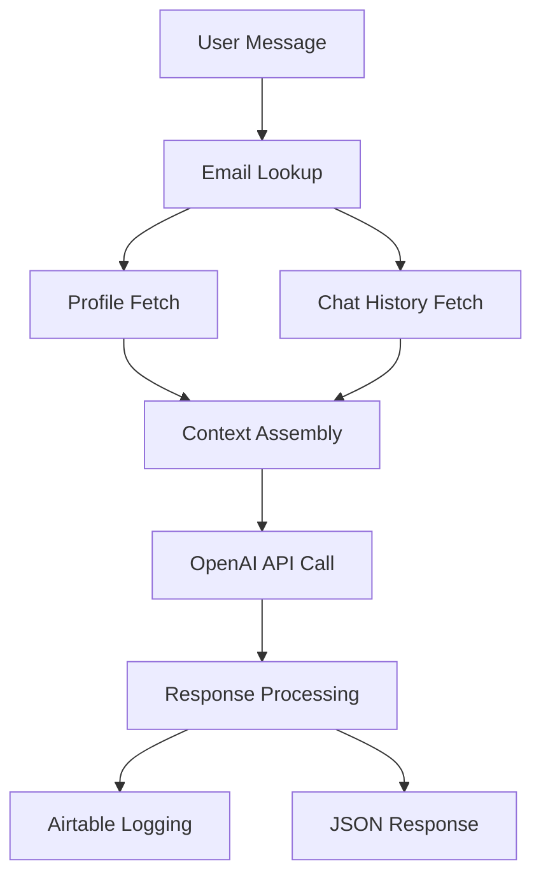

# AI Overview

This document maps all AI functionality, entry points, prompts, models, and data flows within the STRUKT System.

## Core AI Architecture

The STRUKT system is built around a **conversational AI coach** that provides personalized health, fitness, and wellness guidance using OpenAI's GPT models with comprehensive user context and memory.

### Primary AI Model Configuration

- **Primary Model**: GPT-4o (`gpt-4o`)
- **Fallback Model**: GPT-3.5 Turbo (`gpt-3.5-turbo`)
- **Temperature**: 0.7 (configurable via options)
- **Max Tokens**: 500 (configurable via options)
- **Context Window**: Standard OpenAI limits with conversation memory

## AI Entry Points

### 1. Main Chat Endpoint: `POST /ask`

**Location**: `routes/ask.js` → `controllers/aiController.js` → `services/openaiService.js`

**Purpose**: Primary conversational interface for users to interact with the STRUKT AI coach

**Request Schema** (Joi validation):
```javascript
{
  messages: [
    {
      role: "system" | "user" | "assistant",
      content: string (max 2000 chars)
    }
  ],
  email: string (optional, for logging and personalization),
  topic: string (optional, for categorization)
}
```

**Response Format**:
```javascript
{
  success: boolean,
  reply: string
}
```

**Authentication**: None (public endpoint with rate limiting)
**Rate Limiting**: 60 requests per minute per IP

**Data Flow**:
1. **Input Validation** - Joi schema validation
2. **User Identification** - Email lookup in Airtable if provided
3. **Context Building** - Combines system prompt + personalization + memory
4. **AI Processing** - OpenAI API call with fallback handling
5. **Response Logging** - Stores interaction in Airtable chat table
6. **JSON Response** - Returns formatted AI reply

## AI Prompt Strategy

### System Prompt (`utils/prompts/strukt-system-prompt.txt`)

**Role Definition**: "STRUKT Coach" - Smart, structured, inclusive AI assistant for real-life health and fitness support

**Core Capabilities**:
- Custom meal suggestions and logging
- Workout planning and adaptations  
- Supplement advice and reminders
- Mood and mindset check-ins
- Sleep guidance and habit reinforcement
- Progress reviews and analytics

**Coaching Style Guidelines**:
- ✅ Highly personalized based on user data
- ✅ Clear, friendly, structured communication
- ✅ Adaptive tone (friendly/motivational/structured)
- ✅ Concise but supportive responses
- ✅ Action-focused with encouragement
- ✅ Non-judgmental, body-positive, inclusive language

**Behavioral Constraints**:
- ❌ No medical diagnoses or overriding doctor advice
- ❌ No rude, sarcastic, judgmental, or pushy responses
- ❌ No made-up medical facts
- ⚠️ Always include disclaimers for medical content

### Dynamic Context Injection

The system builds a comprehensive context by combining:

1. **Base System Prompt** (static)
2. **Personalization Context** (dynamic from user profile)
3. **Memory Context** (dynamic from chat history)

**Context Building Logic** (`controllers/aiController.js`):
```javascript
systemPromptCombined = [
  defaultPrompt,     // Base STRUKT system prompt
  memoryPrompt,      // Recent conversation history
  personalPrompt     // User onboarding/profile data
].filter(Boolean).join('\n\n');
```

## Personalization Engine

### User Profile Integration (`services/personalisationService.js`)

**Data Source**: Airtable User table (`tbl87AICCbvbgrLCY`)

**Profile Fields Used**:
- Main Goal(s)
- Dietary Needs/Allergies
- Medical Considerations
- Training preferences
- Tone preferences
- Body composition goals

**Personalization Prompt Format**:
```
Here is the user's profile for context:
Goals: [Main Goal]
Dietary needs: [Dietary Needs/Allergies]
Medical considerations: [Medical Considerations]
[Additional fields as available]
```

### Memory & Context Management (`services/memoryService.js`)

**Chat History Source**: Airtable Chat table (`tblDtOOmahkMYEqmy`)

**Memory Strategy**: 
- Fetches last 5 conversations per user
- Simple concatenation format (not AI-summarized)
- Includes both user messages and AI responses

**Memory Prompt Format**:
```
Here is a summary of recent conversations:
Conversation 1:
User: [message]
Assistant: [response]
---
Conversation 2:
User: [message] 
Assistant: [response]
```

## Model Management & Fallback

### Primary Model Configuration
- **Environment Override**: `OPENAI_MODEL` env var
- **Project Scoping**: `OPENAI_PROJECT_ID` for project-scoped API keys
- **Connection Reuse**: Single OpenAI client instance

### Fallback Strategy (`services/openaiService.js`)
```javascript
try {
  // Attempt with primary model (GPT-4o)
  completion = await openai.chat.completions.create({
    model: primaryModel,
    messages: msgs,
    temperature: 0.7,
    max_tokens: 500
  });
} catch (err) {
  // Fallback to GPT-3.5-turbo on model errors
  if (errorType === 'INVALID_PERMISSIONS_OR_MODEL_NOT_FOUND') {
    completion = await openai.chat.completions.create({
      model: 'gpt-3.5-turbo',
      // ... same parameters
    });
  }
}
```

## Error Handling & Observability

### AI Service Error Handling
- **Model Permission Errors**: Automatic fallback to GPT-3.5-turbo
- **Rate Limiting**: Express rate limiter (60 req/min)
- **Timeout Handling**: Standard HTTP timeouts via OpenAI client
- **Error Wrapping**: Custom error messages with status codes

### Logging & Monitoring
- **Chat Interaction Logging**: All conversations stored in Airtable
- **Environment Debug**: API key length and configuration validation
- **Error Logging**: Console error output for debugging
- **No Analytics/Metrics**: Currently console-only observability

### Chat Interaction Logging (`utils/logging.js`)
```javascript
// Logs every AI interaction to Airtable chat table
{
  Name: string,           // Generated identifier
  User: string,           // User record ID
  Message: string,        // User's input message
  AI_Response: string,    // AI's response
  Topic: string           // Optional categorization
}
```

## AI Data Dependencies

### Required External Services
1. **OpenAI API** - Core AI processing
   - API Key: `OPENAI_API_KEY`
   - Project ID: `OPENAI_PROJECT_ID` (optional)
   
2. **Airtable** - User data and conversation storage
   - Base ID: `AIRTABLE_BASE_ID`
   - API Key: `AIRTABLE_API_KEY`

### Data Flow Dependencies


## Security & Rate Limiting

### Input Validation
- **Joi Schema Validation**: Message content limited to 2000 characters
- **Role Validation**: Only system/user/assistant roles accepted
- **Email Validation**: Standard email format validation

### Rate Limiting
- **Global Rate Limit**: 60 requests per minute per IP address
- **Window**: 1 minute sliding window
- **Headers**: Standard rate limit headers included in responses

### Data Privacy
- **No Local Storage**: All user data stored in external Airtable
- **Conversation Logging**: Optional based on email provision
- **No Caching**: Stateless request processing

## Future Enhancement Opportunities

### Short Term
- **AI Memory Summarization**: Use GPT to compress long conversation histories
- **Response Streaming**: Implement server-sent events for real-time responses
- **Advanced Error Handling**: Retry logic with exponential backoff

### Medium Term
- **Vector Memory**: Implement semantic memory search with embeddings
- **Multi-modal Support**: Image analysis for meal/exercise logging
- **A/B Testing**: Multiple prompt variants and response optimization

### Long Term
- **Fine-tuned Models**: Custom STRUKT-specific model training
- **Advanced Personalization**: ML-driven user preference learning
- **Real-time Adaptation**: Dynamic prompt adjustment based on user feedback

---

*Last Updated: August 2024*