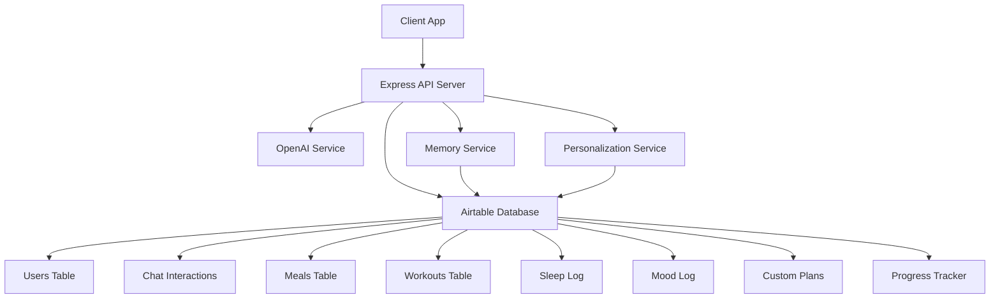
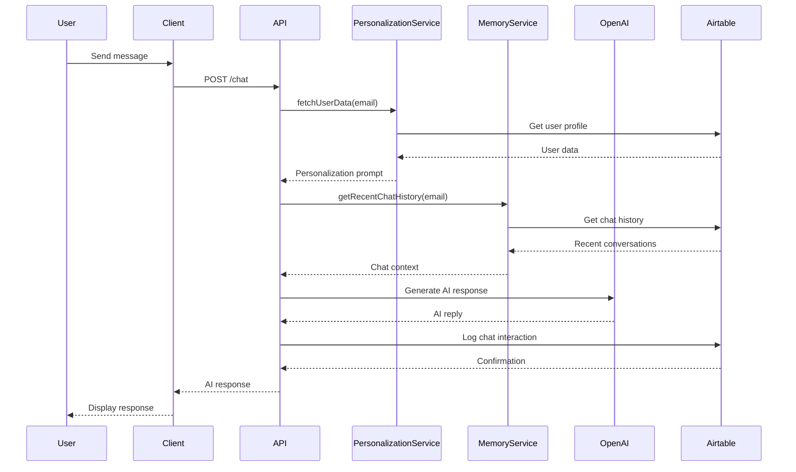

# STRUKT System Architecture

This document outlines the architecture of the STRUKT coaching platform, including system components and their interactions.

## System Overview

The STRUKT system is an AI-powered coaching platform that integrates with Airtable for data storage and OpenAI for intelligent responses. The platform handles user interactions, personalizes coaching experiences, and tracks various health and fitness metrics.

## Component Diagram

## Sequence Diagram

## Core Services

### OpenAI Service
- Handles AI conversation generation
- Manages system prompts and user context
- Provides fallback models for reliability

### Personalization Service
- Fetches user profiles from Airtable
- Builds personalized prompts based on user preferences
- Adapts AI responses to individual goals and context

### Memory Service
- Retrieves recent chat history for context
- Maintains conversation continuity
- Enables the AI to reference past interactions

### Logging Utilities
- Records all user interactions
- Tracks meals, workouts, sleep, and mood data
- Provides structured data for AI analysis and coaching insights

## Data Architecture

The system uses Airtable as its primary database with the following key tables:
- **Users**: Member profiles, goals, and preferences
- **Chat Interactions**: Conversation history and AI responses
- **Meals/Workouts/Sleep/Mood**: Health and fitness tracking data
- **Custom Plans**: AI-generated nutrition and workout plans
- **Progress Tracker**: Weight, photos, and progress metrics

## Security Considerations

- API keys are managed through environment variables
- Rate limiting is implemented for API protection
- User data is validated before storage
- Helmet.js provides additional security headers