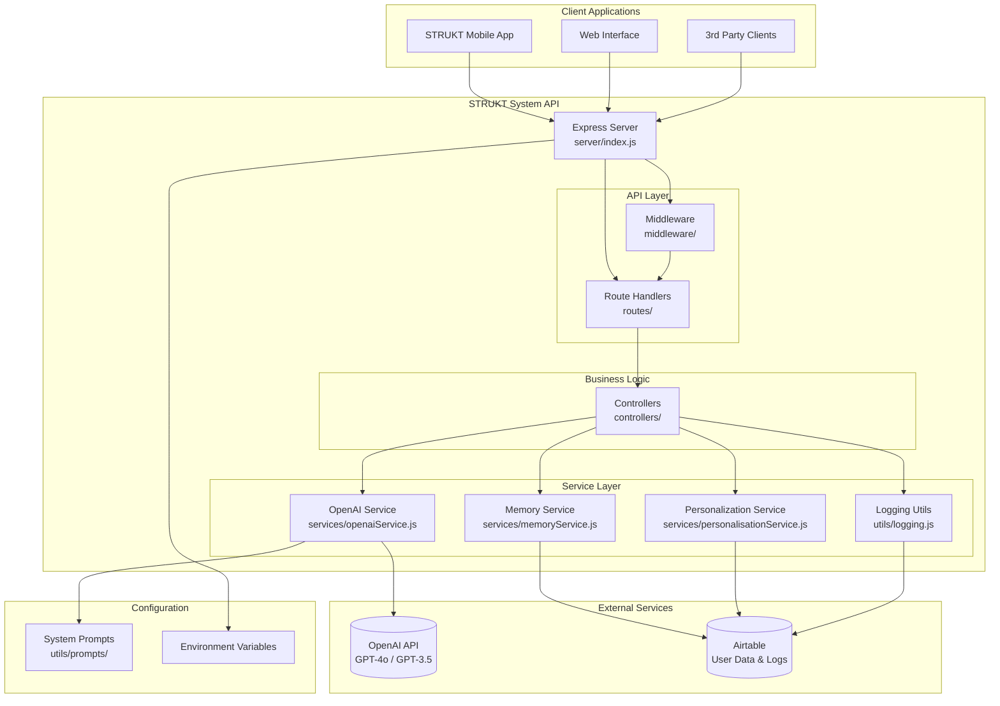
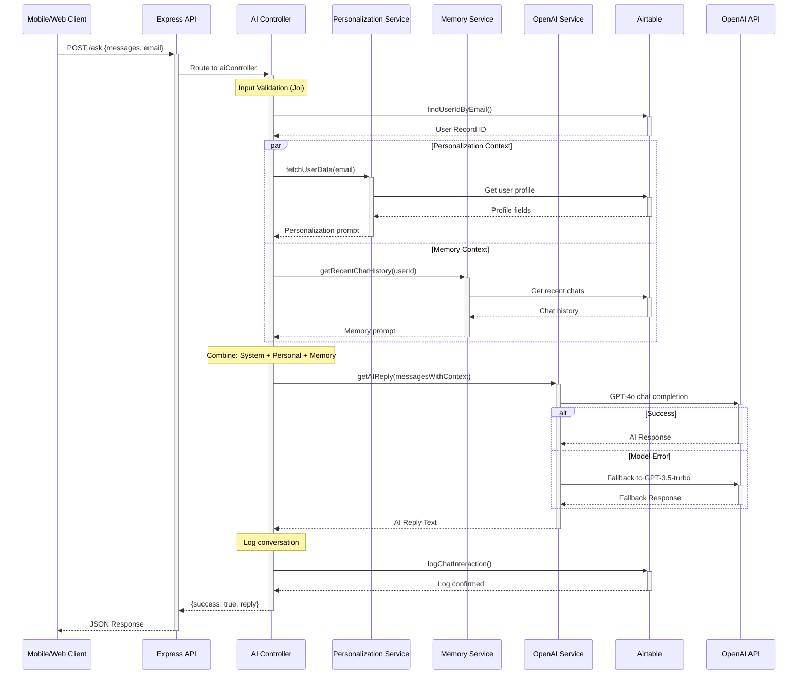
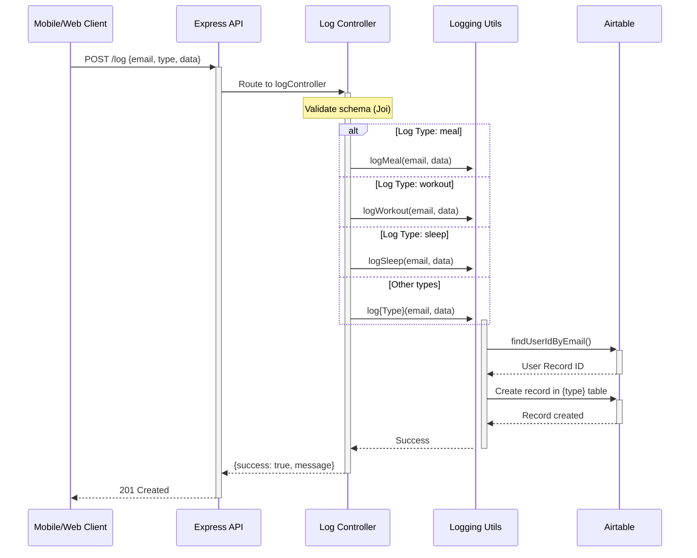
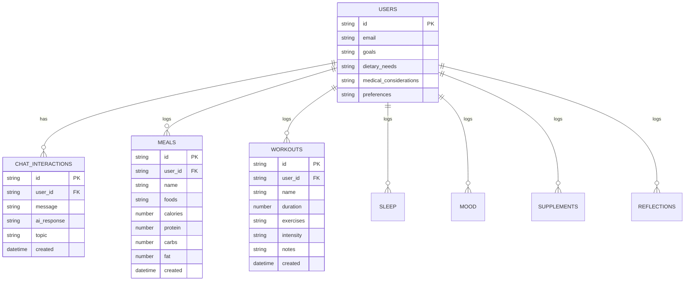
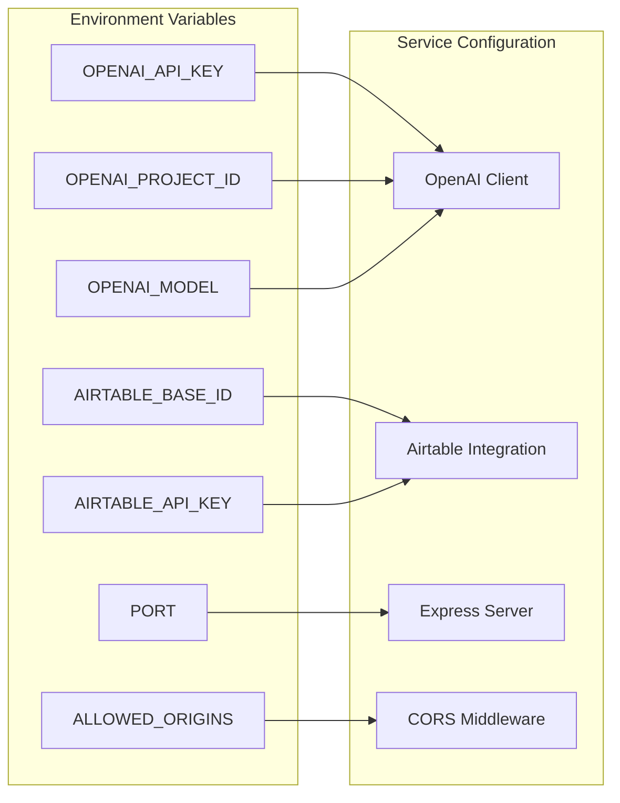
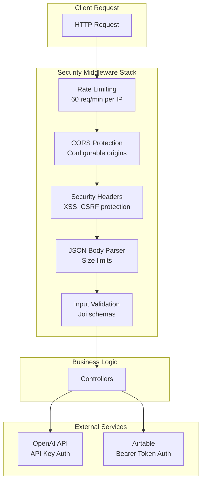

# System Architecture

This document provides a high-level overview of the STRUKT System architecture, including component relationships, data flows, and integration patterns.

## High-Level System Overview

The STRUKT System is a **stateless Node.js API** that serves as the backend for a conversational AI health coach. The system integrates with external services (OpenAI, Airtable) to provide personalized health and fitness guidance.

### Core Architecture Principles

- **Stateless Design**: No local database, relies on external services
- **Microservice-Ready**: Modular structure with clear service boundaries  
- **API-First**: RESTful JSON API designed for mobile and web clients
- **External Integration**: Heavy reliance on best-in-class external services
- **Conversation-Driven**: AI chat as the primary user interface

## System Components

## Request Flow Architecture

### AI Chat Request Sequence

### Data Logging Flow

## Data Architecture

### Airtable Schema Integration

The system integrates with multiple Airtable tables for data persistence:

### Environment Configuration

## Technology Stack Details

### Runtime Environment
- **Node.js**: JavaScript runtime
- **Express.js**: Web framework
- **NPM**: Package management

### External Integrations
- **OpenAI API**: GPT-4o and GPT-3.5-turbo models
- **Airtable**: Database and user management
- **Heroku**: Deployment platform (via app.json)

### Core Dependencies
- **axios**: HTTP client for external API calls
- **joi**: Input validation and schema enforcement
- **helmet**: Security headers
- **cors**: Cross-origin resource sharing
- **express-rate-limit**: Rate limiting middleware
- **dotenv**: Environment variable management

## Security Architecture

### Security Layers

### Security Considerations

- **Rate Limiting**: Protection against abuse and DoS attacks
- **Input Validation**: Prevents injection attacks via Joi schemas
- **No Authentication**: Public API with email-based user identification
- **External API Security**: Secure credential management for OpenAI and Airtable
- **CORS Configuration**: Controlled cross-origin access

## Deployment Architecture

### Heroku Deployment

The system is configured for Heroku deployment with:

- **`app.json`**: Heroku app configuration
- **`package.json`**: Node.js start script configuration
- **Environment Variables**: Managed via Heroku config vars
- **Process Type**: Single web dyno running Express server

### Scaling Considerations

- **Stateless Design**: Horizontal scaling capability
- **External Dependencies**: No local database to manage
- **Memory Usage**: Minimal server-side state
- **Connection Pooling**: Single OpenAI client instance reuse

## Performance Characteristics

### Response Times
- **Simple Chat**: 200-500ms (depends on OpenAI API)
- **Complex Context**: 500-2000ms (user lookup + context building)
- **Data Logging**: 100-300ms (Airtable API calls)
- **Chat History**: 100-500ms (depends on history size)

### Bottlenecks
- **OpenAI API**: Primary latency source
- **Airtable API**: Secondary latency for user data
- **Context Building**: CPU-intensive for large histories
- **Rate Limiting**: 60 req/min ceiling

## Integration Patterns

### External Service Integration
- **Circuit Breaker**: OpenAI fallback model pattern
- **Retry Logic**: Basic error handling (no exponential backoff)
- **Connection Reuse**: Single client instances
- **Error Propagation**: Structured error responses

### Data Flow Patterns
- **Request-Response**: Synchronous API calls
- **No Caching**: Fresh data on every request  
- **No Queuing**: Direct processing of all requests
- **Logging**: Async fire-and-forget to Airtable

## Future Architecture Considerations

### Near-Term Enhancements
- **Response Caching**: Redis for repeated context building
- **Async Processing**: Queue system for non-critical operations
- **Monitoring**: Application performance monitoring (APM)
- **Health Checks**: Structured health endpoint

### Long-Term Evolution
- **Microservices**: Split AI, data, and user services
- **Event Streaming**: Real-time data flows
- **Edge Computing**: Global deployment for reduced latency
- **Database Migration**: Move from Airtable to dedicated database

---

*Last Updated: August 2024*